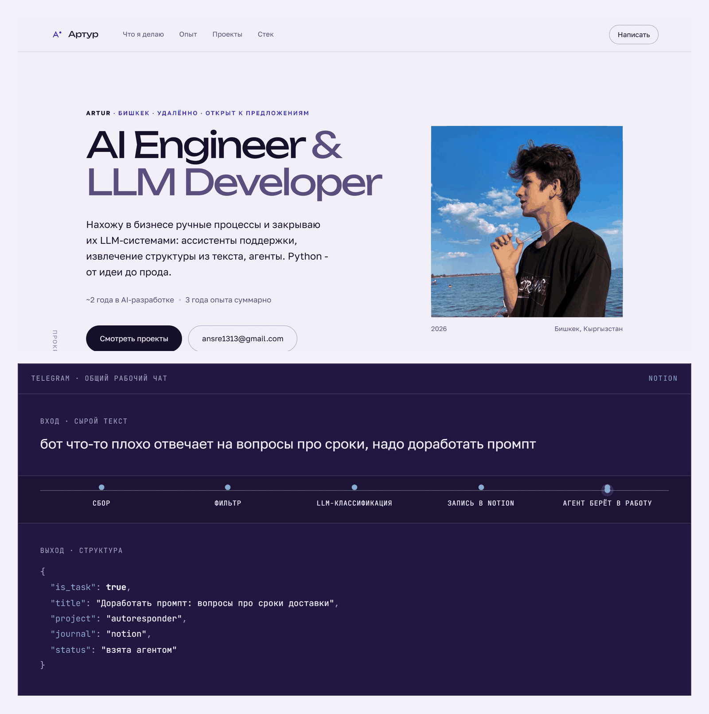

# artirain.github.io

Портфолио-резюме: Артур, AI Engineer - https://artirain.github.io



Статика без сборки: `index.html`, `styles.css`, `main.js`, шрифты с Google Fonts.
Деплой - GitHub Pages из ветки `main`.

## Локально

```
python -m http.server 8899
```

## Что внутри

- **Герой** - роль крупно, портрет, ссылки на почту и проекты.
- **Живой конвейер** - сырой текст печатается, проходит стадии и превращается в JSON.
  Три примера соответствуют трём реальным проектам (notion, job-hunter, artirain-rag).
  Уважает `prefers-reduced-motion`: при выключенной анимации показывает финальный кадр.
- **Опыт, проекты с измеренными результатами, стек, контакты.**

## Устройство

```
index.html    разметка + инлайновый SVG-спрайт с логотипами стека (simple-icons)
styles.css    токены темы; .invert переключает светлую секцию в тёмную
main.js       появление блоков (IntersectionObserver) + цикл конвейера
assets/       портрет
docs/         превью для этого README
```

Правки контента - прямо в разметке. Примеры конвейера - в `SAMPLES` в `main.js`.
Палитра и типографика - в `:root` и `.invert` в `styles.css`.

Абсолютные ссылки есть только в `og:url` и `og:image`. При смене адреса сайта
править надо именно их, остальные пути относительные.
